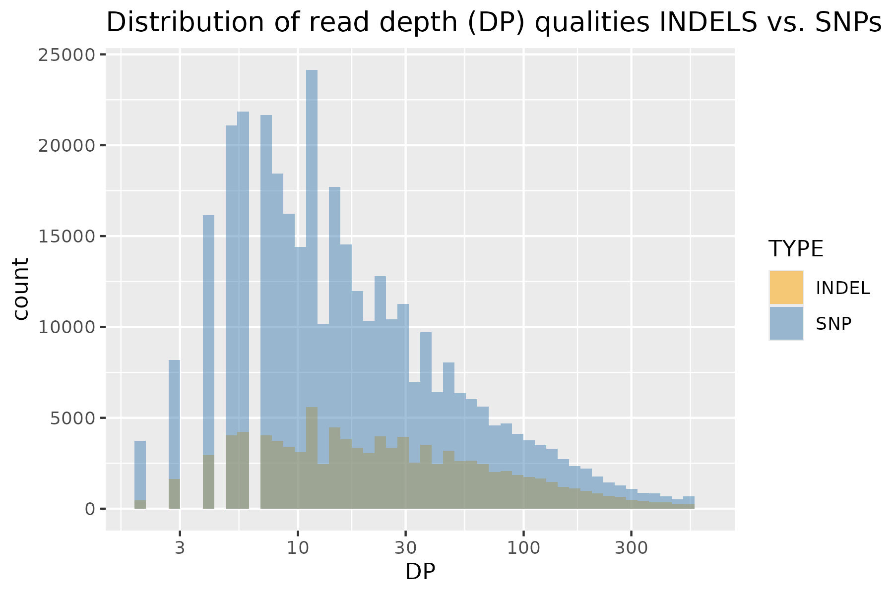
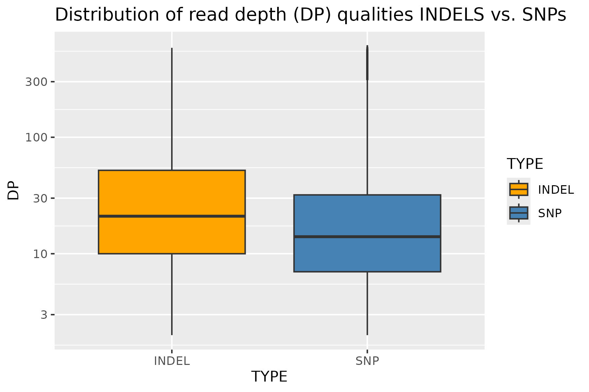

[](https://classroom.github.com/a/SzF8zjrH)

# Distribution of read depth (DP) qualities INDELS vs. SNPs

## Git Bash
Some of the code I used is referenced directly from the solution to the variant quality task.

### I. Preparing data
First after getting to the right directory, I decompress the file with zcat and move the contents excluding headers to a new file:
```
cd ~/projects/ngs-course-final-assignment-25-26-valencil

</data-shared/vcf_examples/luscinia_vars_flags.vcf.gz zcat |
  grep -v '^#' \
> no-headers.vcf
```

### II. Extracting needed data from file
Using the new header-less file as input I find all of the DP values and put them in a new file, then I separate all a
entries into INDELs and SNPs by searching the text for INDEL and put those values into another new file.
```
IN=no-headers.vcf
<$IN grep -E -o 'DP=([^;]+)' | sed 's/DP=//' > col-dp.tsv
<$IN awk '{if($0 ~ /INDEL/) print "INDEL"; else print "SNP"}' > col-type.tsv
```
### III. Putting it together
Then I check if the length of all of the files is the same (and therefore they include all entries), then put the DP and type value files together into one final file, that I can use for analysis.
```
wc -l *.tsv
paste col-dp.tsv col-type.tsv > cols-all.tsv
```
___
## R studio

### I. Preparing
To begin with, I simply got the library for ggplots and set the right working directory.
```
library(tidyverse)
setwd("~/projects/ngs-course-final-assignment-25-26-valencil")
```

### II. Processing data from file
Then I put my data from the file into a variable (a data frame):
```
d <- read_tsv(
  "cols-all.tsv",
  col_names = c("DP", "TYPE")
)
```

### III. Plotting
Using my data frame I made a histogram with ggplot. The x scale is logarithmic to make the graph easily readable given the biological data. I made the bars transparent, so all vales could be plainly seen and it would be clear that the bars are overlapping.
```
ggplot(d, aes(x = DP, fill = TYPE)) +
  geom_histogram(alpha = 0.5, position = "identity", bins = 50) +
  scale_x_log10() +
  ggtitle("Distribution of read depth (DP) qualities INDELS vs. SNPs") +
  scale_fill_manual(values = c("SNP" = "steelblue", "INDEL" = "orange"))
```
Then I saved the graph as a jpeg:
```
ggsave(filename = "~/projects/ngs-course-final-assignment-25-26-valencil/results/histogram.jpeg", plot = last_plot(), width = 6, height = 4, units = "in", dpi = 300)
```

Then I made a simple boxplot for another comparison between the types:
```
d %>%
  ggplot(aes(TYPE, DP, fill = TYPE)) +
  geom_boxplot(outlier.size = 0.01) +
  ggtitle("Distribution of read depth (DP) qualities INDELS vs. SNPs") +
  scale_y_log10()
```
And also saved this plot:
```
ggsave(filename = "~/projects/ngs-course-final-assignment-25-26-valencil/results/boxplot.jpeg", plot = last_plot(), width = 6, height = 4, units = "in", dpi = 300)
```

### IV. Statistics
For further analysis I summarized some basic values for each type: mean, median, standard deviation and interquartile range. This part was aided by ChatGPT, since I lack experience in biostatistics (I would probably not think to use interquartile range on my own). 
```
d %>%
  group_by(TYPE) %>%
  summarise(
    n = n(),
    mean_DP = mean(DP, na.rm = TRUE),
    median_DP = median(DP, na.rm = TRUE),
    sd_DP = sd(DP, na.rm = TRUE),
    IQR_DP = IQR(DP, na.rm = TRUE)
  )
```

Lastly I perform the Wilcox test (as also suggested by ChatGPT):
```
wilcox.test(DP ~ TYPE, data = d)
```
___
## Results

### I. Plots

We can clearly see that both the SNPs are most frequent at lower read depths due to coverage bias, as lower read regions are more numerous. SNPs are also more frequent than indels at all read depths.
In the indels, this is less apparent. Indels do visibly somewhat adhere to coverage bias, being higher at more frequently detected read depths, however, their distribution is still visibly more skewed towards longer reads in comparison to SNPs.



The boxplot confirms the median and interquartile range are higher for indels. 

### II. Statistics

```
> d %>%
+   filter(TYPE %in% c("SNP", "INDEL")) %>%
+   group_by(TYPE) %>%
+   summarise(
+     n = n(),
+     mean_DP = mean(DP, na.rm = TRUE),
+     median_DP = median(DP, na.rm = TRUE),
+     sd_DP = sd(DP, na.rm = TRUE),
+     IQR_DP = IQR(DP, na.rm = TRUE)
+   )
# A tibble: 2 × 6
  TYPE       n mean_DP median_DP sd_DP IQR_DP
  <chr>  <int>   <dbl>     <dbl> <dbl>  <dbl>
1 INDEL  99537    47.7        21  71.7     42
2 SNP   354671    33.7        14  58.7     25
```
The statistical data is well reflected on the plots. The number of SNPs is much higher than indels, as was noted on the histogram.
We can also again confirm that both the mean and median are higher for indels. Clear from the numbers is the higher variablity of indel DPs, they have a larger interquartile range and higher standard deviation.

```
> wilcox.test(DP ~ TYPE, data = d %>% filter(TYPE %in% c("SNP","INDEL")))

	Wilcoxon rank sum test with continuity correction

data:  DP by TYPE
W = 2.0943e+10, p-value < 2.2e-16
alternative hypothesis: true location shift is not equal to 0
```
The wilcox test confirms that the difference between SNP and indel DPs is statistically significant The p-value is very low, indicating that the probability of this difference being a coincidence is very low.

## Conclusions
As is expected, the number of detected SNPs is overall higher than that of indels, which is normal.
Indels are more likely to be detected at higher DPs and therefore in regions with higher sequencing coverage. This makes sense, as the requirements for detecting an indel are higher that hat of an SNP - it requires a higher alignment quality to avoid false positives.
